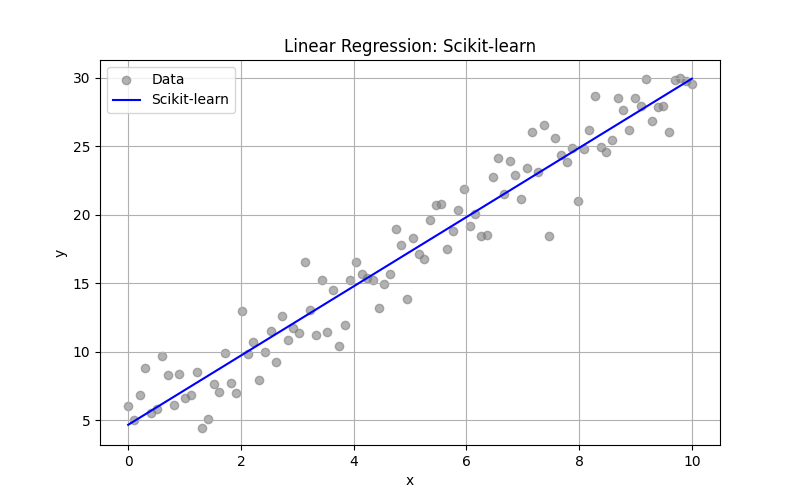
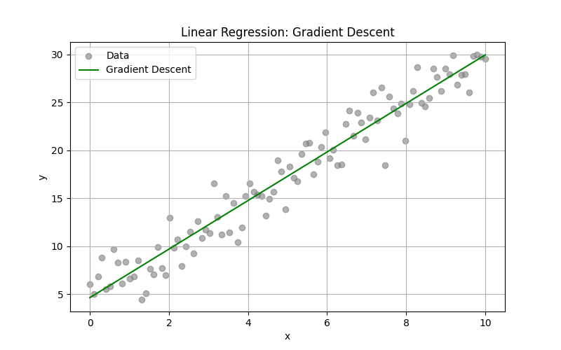

# 🔢 Linear Regression — Scratch to Scikit-learn

This project demonstrates **Linear Regression** using three different methods:

1. ✅ **Scikit-learn** — library-based implementation  
2. 🔧 **Gradient Descent** — iterative method, implemented from scratch  
3. 🧮 **Least Squares** — closed-form analytical solution  

We use a **synthetic dataset** generated from the equation:

> 🧾 `y = 2.5x + 5 + noise`

---

## 📁 Project Structure

<pre>
linear-regression-three-ways/
├── data/
│   └── dataset.csv              # Generated synthetic dataset
├── models/
│   ├── sklearn_model.py         # Linear regression using Scikit-learn
│   ├── gradient_descent.py      # Linear regression using gradient descent (from scratch)
│   └── least_squares.py         # Linear regression using least squares (analytical method)
├── plots/
│   ├── regression_sklearn.png           # Plot of scikit-learn model
│   ├── regression_gradient_descent.png # Plot of gradient descent model
│   └── regression_least_squares.png     # Plot of least squares model
├── generate_data.py             # Script to generate synthetic dataset
├── main.py                      # Runs all models, prints results, and saves plots
├── requirements.txt             # Python dependencies
└── README.md                    # Project documentation
</pre>

---

## ⚙️ How to Install and Run

### 1. Clone the repository
```bash
git clone https://github.com/your-username/linear-regression-three-ways.git
cd linear-regression-three-ways
```

### 2. Install dependencies
```bash
pip install -r requirements.txt
```

### 3. Generate the dataset
```bash
python generate_data.py
```

### 4. Run the models
```bash
python main.py
```

---

## 🧠 Explanation of the Three Methods

| Method           | Description                                                                 |
|------------------|-----------------------------------------------------------------------------|
| **Scikit-learn** | Uses `LinearRegression` from the `sklearn.linear_model` module.            |
| **Gradient Descent** | Iteratively minimizes Mean Squared Error (MSE) using manual updates to weights and bias. |
| **Least Squares** | Uses matrix algebra to solve for the best-fit line in one step (analytical). |

---

## 📊 Example Output

After running `main.py`, you’ll see output like:
```bash
🔍 Model Results:
Scikit-learn     → w = 2.49, b = 4.98, MSE = 2.91
Gradient Descent → w = 2.48, b = 4.99, MSE = 2.94
Least Squares    → w = 2.49, b = 4.98, MSE = 2.91
```

---

## 🖼️ Model Plots

Each model produces a visualization showing the fitted regression line over the data:

| Scikit-learn | Gradient Descent | Least Squares |
|--------------|------------------|----------------|
|  |  |  |

These plots help visualize how well each method fits the data. Despite using different approaches, all three produce very similar results because the data is linear and noise is minimal.

---

## 🚀 Future Enhancements

Here are some ideas for improving and expanding the project:

- 📉 **Residual Plots**: Visualize the prediction errors (residuals) for deeper insights.
- 📈 **Multivariate Linear Regression**: Extend the current setup to handle multiple features.
- 🏠 **Real-World Datasets**: Apply the models to real datasets like the California Housing dataset.
- ⏱️ **Performance Metrics**: Compare training times or convergence steps (especially for gradient descent).
- 🧪 **Regularization**: Add L1/L2 regularized versions of gradient descent.

---

## 🙋‍♂️ Why I Built This

As a beginner, I wanted to understand Linear Regression deeply, not just use libraries. This project helped me learn:
- How regression works mathematically
- How to write and compare different implementations
- How to organize a machine learning project

---

🧠 *This project is intentionally beginner-friendly — ideal for learning how linear regression works both mathematically and in practice with libraries.*

---